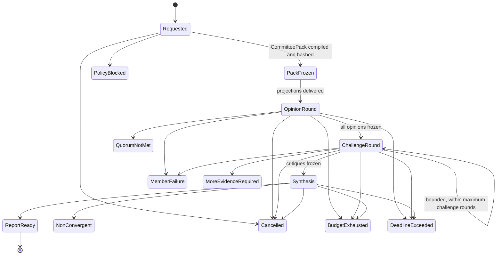

# 36 — Engineering Committee (Governed Multi-Model Deliberation Protocol)

**Formal name:** Engineering Committee. **Product/UI name:** Committee.
**Protocol class:** Governed Multi-Model Deliberation Protocol.
**Standing:** Proposed architecture. Nothing in this document authorizes
implementation, provider integration, or any change to runtime behavior.
Decision record: [ADR-0026](adr/ADR-0026-engineering-committee.md) (Proposed).
Falsifiable admission evidence:
[37 — Committee Evaluation Protocol](37_Committee_Evaluation_Protocol.md).

## 1. Identity and invariant

The Committee lets a user select three or more members — Hermes runtime
profiles, local open-weight models, supported remote model APIs, or enterprise
runtime profiles — to review a project, phase, plan, risk, pull request,
architecture decision, non-convergence event, or completion package. Members
reason independently, challenge each other in bounded rounds, preserve
disagreement, and produce one evidence-linked `CommitteeReport`.

**The Committee is advisory.** It is a reading instrument, not an engineering
authority. It must never modify durable plans directly, approve its own
recommendations, approve mission completion, grant capability, close a security
finding, promote a Skill, or replace deterministic evidence.

**Committee agreement is not engineering truth.** Agreement among models is a
signal about model behavior; deterministic gates, evidence, and authenticated
human decisions remain the only acceptance basis, exactly as in
[31 — Governed Specification Workflow](31_Governed_Specification_Workflow.md)
and [33 — Model-Independent Outcome Convergence](33_Model_Independent_Outcome_Convergence.md).

## 2. Authority boundary

The governing chain of [16 — Data Model](16_Data_Model.md) is unchanged:

Governance Policy → Approved Specification → Outcome Contract → Approved
DeliveryPlan → Phase Plan → TaskPacket → Tool Action.

The Committee sits **outside the authority chain**. It consumes read-only
projections and produces advisory artifacts only. A majority vote never
approves a plan, never changes a specification or an Outcome Contract, never
authorizes an effect, never accepts a mission, never grants capability, never
closes a security finding, never promotes a Skill, and never overrides
deterministic evidence.

The only path from Committee output to durable change is the existing plan
governance pipeline:

`CommitteeReport` → Mastermind review → optional `PlanChangeProposal` →
deterministic structural validation → independent Consulting assessment where
policy requires → authenticated `PlanDecision` → new `DeliveryPlan` version.

A `PlanChangeProposal` is the Committee-originated form of the existing
`PlanProposal` artifact: it enters the same qualification, validation, and
`PlanDecision` machinery as any other proposal and carries a provenance link to
the `CommitteeReport` that motivated it. It receives no shortcut, no elevated
priority, and no reduced review tier because a Committee produced it. A plan
update creates a **new version**; historical plan versions, opinions, critiques,
and reports are never edited — exact history is preserved under the record
invariants of [16 — Data Model](16_Data_Model.md) and the append-only event
authority of [17 — Event System](17_Event_System.md).

## 3. Role relationships

The Committee protocol names governed roles. Each binds to an existing
architectural boundary and creates no new authority:

| Protocol role | Anchors to | Responsibility toward the Committee |
| --- | --- | --- |
| Researcher Agent | staged retrieval and context boundaries of [32 — Hermes Runtime](32_Hermes_Engineering_Intelligence_Runtime.md) | discovers information and produces `ResearchPacket` inputs offered to the pack compiler; never talks to members directly |
| Wisdom Agent (Committee Chair) | synthesis role over frozen artifacts | chairs synthesis; cannot hide disagreement or invent consensus; not final authority |
| Mastermind Agent | plan-owning Brain role under [ADR-0016](adr/ADR-0016-brain-plan-builder-execution-separation.md) | reads the `CommitteeReport`; may author a `PlanChangeProposal`; cannot bypass validation or `PlanDecision` |
| Builder Agent | execution role under [ADR-0016](adr/ADR-0016-brain-plan-builder-execution-separation.md) | does not review its own work by default; a **separate, fresh Builder-specialist profile** may provide implementation-feasibility analysis as an ordinary member |
| Consulting Agent | independent self-review boundary of [32 — Hermes Runtime](32_Hermes_Engineering_Intelligence_Runtime.md) §11 | independently assesses delivery and Committee-derived plan changes; independence is structural, not claimed |
| Core | sole durable authority ([17 — Event System](17_Event_System.md)) | owns every session artifact, transition, budget, and record; the only writer of durable truth |

The producing Mastermind or Builder **does not satisfy an independent-review
requirement by joining the Committee.** Independence requires a distinct
invocation identity, a distinct context trail, and no authorship of the
artifact under review.

## 4. Membership model

A Committee role is not identical to a model. A `CommitteeMember` is a full
governed binding:

| Binding field | Meaning |
| --- | --- |
| provider | Hermes, local runtime, or a supported remote API family |
| model / runtime profile | exact model id or certified Hermes profile version |
| deployment | local process, local server, enterprise gateway, or remote region |
| assigned perspective | the `CommitteePerspective` this member argues from |
| invocation identity | unique per member per session; appears on every artifact |
| context scope | which `CommitteePackProjection` this member receives |
| skills | pinned skill/prompt assets used for the role, by hash |
| capability boundary | none beyond read-only pack access; members hold no tool authority |
| data-egress policy | classes of data this member may receive (§8) |
| cost limit | member token/cost budget (§9) |
| timeout | member response deadline |
| provenance | adapter version, configuration hash, reported model version |
| evaluation status | certification state under [ADR-0025](adr/ADR-0025-model-profile-certification.md) where applicable |

The same underlying provider may participate more than once **only when policy
permits**, and each invocation must have a distinct role, context projection,
invocation identity, and evidence trail.

**Diversity reporting.** Core reports low diversity when members share
provider, model family, training lineage, context strategy, or reasoning
profile. The diversity score is advisory: it flags correlated-failure risk and
must not be read as proof of independence, and high diversity must not be read
as proof of correctness.

## 5. Provider and runtime model

The Committee is provider-neutral by construction. Supported member sources:

- Hermes runtime profiles (including local-only operation);
- local open-weight models;
- OpenAI-compatible APIs;
- Anthropic-compatible adapters;
- Kimi/Moonshot-compatible adapters;
- Gemini-compatible adapters;
- enterprise model gateways;
- future provider plugins under [15 — Plugin System](15_Plugin_System.md);
- mixed local and remote deployments in one session.

Adapters normalize transport only. They must not normalize away provenance:
the reported model identity, adapter version, and configuration hash are
recorded per response, so silent model substitution is detectable (§11).

## 6. Subscription and credential boundary

- Consumer chat subscriptions are **not** assumed to provide programmatic
  access.
- WePLD uses supported APIs, local runtimes, enterprise gateways, or official
  provider integrations only.
- WePLD **must not capture browser cookies, automate consumer chat sessions, or
  circumvent provider usage restrictions**.
- A user may provide their own API credentials; a user may run a Committee on
  local/Hermes profiles only; hybrid Committees are supported.
- Provider credentials remain behind the Effect Firewall and the Secret
  Manager — the credential-holding component of the provider boundary in
  [14 — Security Architecture](14_Security_Architecture.md). Raw credentials
  never enter `ContextPack`s, `CommitteePack`s, projections, logs, reports, or
  any model-visible content.

## 7. Deliberation protocol

The protocol is finite. Every stage transition is a Core-recorded event; every
artifact is typed, hashed, and immutable once frozen.

### Stage 1 — Committee request

A user or an authorized policy creates a `CommitteeRequest` specifying:
subject; reason; requested members or preset; required perspectives; artifacts
in scope; data classification; provider permissions; budget; maximum rounds;
quorum; deadline; trigger; expected output.

### Stage 2 — Frozen CommitteePack

Core compiles **one immutable, versioned, hashed** `CommitteePack`. It may
contain: approved specification references; Outcome Contract references; the
exact plan version; phase state; task status; relevant diff; tests; evidence;
risks; unresolved findings; prior decisions; bounded repository context; and
explicit questions.

Repository text, tool output, comments, commits, issues, external content, and
historical memory inside the pack are **untrusted data**. They cannot become
Committee instructions; only Core-authored pack framing addresses members, and
members are told which spans are untrusted data.

Each member may receive a narrower `CommitteePackProjection` according to its
provider and data-egress policy. The exact projection, its redactions, and its
hashes are recorded per member.

### Stage 3 — Independent opinion round

Each member produces its `MemberOpinion` **before seeing any other member's
opinion**. This independence requirement exists to reduce anchoring and group
imitation, and it is structural: Core withholds all peer material until every
first-round opinion is frozen.

Every opinion must classify each claim as one of: `VerifiedFact`,
`Observation`, `Inference`, `Hypothesis`, `Recommendation`, `Unknown` — and
must include: findings; evidence references into the pack; assumptions; risks;
proposed changes; confidence; unresolved questions; prohibited claims it was
asked not to make; and limitations.

### Stage 4 — Bounded challenge round

After all first-round opinions are frozen, Core builds a bounded critique pack
from the frozen opinions. Members may identify contradictions, challenge
unsupported claims, question evidence, revise their positions, retain
objections, and issue at most one bounded `EvidenceClarificationRequest`.

Members have **no unrestricted peer-to-peer chat**. All communication flows
through Core-owned typed artifacts (`MemberCritique`, `MemberResponse`),
each frozen and hashed like the opinions.

### Stage 5 — Wisdom synthesis

The Wisdom Agent (Committee Chair) synthesizes the frozen opinions and
critiques into a `CommitteeReport`. The Chair cannot hide disagreement or
invent consensus. The synthesis must preserve: areas of agreement; material
disagreements; minority reports; unsupported claims; missing evidence; member
failures; conflicts of interest; confidence; recommended next actions; and
recommendations that would require authorization. **Minority reports are
preserved verbatim** as `MinorityReport` artifacts attached to the report; the
Chair may annotate them but never rewrite or drop them. The Chair is not final
authority.

### Stage 6 — Committee disposition

Every session ends in exactly one durable `CommitteeDisposition`:

| Disposition | Meaning |
| --- | --- |
| `ReportReady` | synthesis complete; report and dissent preserved |
| `QuorumNotMet` | too few valid independent opinions |
| `MoreEvidenceRequired` | honest stop: the question is not answerable from the pack |
| `MemberFailure` | a member failed and policy did not permit continuing |
| `BudgetExhausted` | a cost or token ceiling was reached |
| `DeadlineExceeded` | the deadline passed before completion |
| `PolicyBlocked` | policy (egress, classification, provider) refused execution |
| `Cancelled` | the user or an authorized principal cancelled |
| `NonConvergent` | positions remained materially opposed; recorded as such |

A failed or incomplete session **remains durable evidence**. It is never
relabelled as consensus, and `NonConvergent` is an honest, useful outcome —
not an error to retry silently.

## 8. Privacy and data-egress model

Per-member context and egress controls are mandatory. Before execution, the
user must be able to inspect, for every member: provider; model/profile;
deployment location; data classes sent; file/context scope; redactions;
retention assumptions; approximate tokens; estimated cost; maximum cost; and
number of rounds.

Supported Committee context modes:

- local-only Committee (no remote egress at all);
- no-source-code Committee;
- specification-only Committee;
- selected-diff Committee;
- evidence-summary Committee;
- full approved-context Committee.

A remote member must not receive more context than its **data-egress policy**
allows; the projection mechanism (§7 Stage 2) enforces this structurally, and
the recorded projection hashes prove after the fact exactly what left the
machine. A member refusal caused by data policy is an honest outcome, recorded
as such — never silently worked around by widening the projection.

## 9. Cost and resource governance

Every session carries deterministic limits: per-member token budget; per-round
budget; session budget; a **hard cost ceiling**; timeout; maximum context;
maximum artifacts; maximum findings; **maximum challenge rounds**; and maximum
`EvidenceClarificationRequest`s.

Budget exhaustion produces the durable `BudgetExhausted` disposition and cannot
silently trigger additional calls. Where provider pricing information is
available, Core estimates cost before authorization and shows it in the §8
pre-execution inspection. The design must function when pricing information is
unavailable: the hard token/request budget is the enforcement primitive, and
currency estimates are advisory display only.

`CommitteeCostRecord` and `CommitteeUsageRecord` artifacts make actual spend
per member, per round, and per session durable and auditable.

## 10. Failure and recovery

All failure handling follows the delivery/idempotency/uncertain-effect
semantics of [17 — Event System](17_Event_System.md): terminal truth is
recorded, retries are idempotent, and a superseding artifact never edits its
predecessor.

| Case | Contract |
| --- | --- |
| one member unavailable | record `CommitteeFailureRecord`; continue only if quorum policy allows, else `MemberFailure` / `QuorumNotMet` |
| provider timeout | member marked failed for the round after its timeout; no unbounded waiting |
| malformed output / schema failure | structural validation rejects the artifact; bounded re-request within budget; then failure record |
| content-policy refusal | honest member outcome; recorded verbatim as a refusal, never paraphrased into an opinion |
| quota exhaustion | member failure; session continues or ends per quorum policy |
| partial round completion | the round is incomplete until every member answered or failed terminally; partial rounds are never synthesized as complete |
| Chair failure | session ends `MemberFailure` (chair role); frozen opinions/critiques remain durable and reusable by a successor session |
| user cancellation | `CommitteeCancellation` recorded; `Cancelled` disposition; artifacts retained |
| process crash | on restart, Core resumes from durable stage state; frozen artifacts are never regenerated; unfrozen work is discarded and the stage re-runs idempotently |
| duplicate delivery | artifact identity + hashes make delivery idempotent; duplicates are no-ops |
| uncertain provider result | recorded as uncertain, treated as no response; never guessed into an opinion |
| provider model silently changed | per-response provenance (§5) detects reported-identity drift; the affected opinions are flagged and the diversity/validity assessment re-runs |
| context projection mismatch | projection hash mismatch invalidates the member's round; recorded, never patched silently |
| budget exhaustion | durable `BudgetExhausted`; no silent continuation |
| session reopening | closed sessions are never reopened; a follow-up is a **new** session that references the prior one (supersession, exact history) |

A failed member is **not automatically replaced** unless policy explicitly
permits it. Any replacement is recorded as a new member assignment with its own
identity and evidence trail, and the report must present the actual final
membership — never the originally selected Committee as if unchanged.

## 11. Security threat model

All member output is **untrusted until structurally validated and linked to
evidence**. Extends [14 — Security Architecture](14_Security_Architecture.md):

| Threat | Position |
| --- | --- |
| prompt injection through repository content | pack data is typed untrusted (§7 Stage 2); instructions come only from Core framing; findings citing injected "instructions" remain data |
| malicious member output | schema validation, evidence-linkage checks, and prohibited-claim lists; output grants nothing |
| collusion / correlated failure | independence-by-construction first round; diversity reporting; evaluation protocol measures imitation |
| model/provider impersonation | recorded provider, adapter version, reported model identity per response |
| hidden model substitution | provenance drift detection (§10); flagged, not silently accepted |
| credential leakage | credentials never enter model-visible content (§6); Effect Firewall + Secret Manager boundary |
| context over-sharing | per-member projections with recorded redactions and hashes (§8) |
| minority-report suppression | `MinorityReport` is verbatim-preserved and validator-checked; a report without dissent handling is invalid |
| fabricated citations / evidence references | every finding must reference pack hashes; unresolvable references are flagged as unsupported claims |
| cost-amplification loops | hard ceilings; `BudgetExhausted` is terminal (§9) |
| denial of service | member timeouts, session deadline, maximum artifacts/findings |
| repeated debate | maximum challenge rounds; session reopening prohibited (§10) |
| plan mutation without authority | Committee artifacts are advisory; only the §2 pipeline changes plans |
| findings granting capability | members hold no capability; reports confer none |
| model voting presented as acceptance | votes carry no authority anywhere; acceptance is deterministic evidence + authenticated decision |
| poisoned Engineering Memory influencing outcomes | memory enters packs only as labelled untrusted context under the existing memory-injection rules; Committee output cannot write memory (§12) |

## 12. Relationship to Engineering Memory and SkillHouse

Committee content does **not** automatically become Engineering Memory. After
a mission or phase is verified: Committee findings may become
`MemoryCandidate`s; verified recurring deliberation patterns may become
`SkillCandidate`s; DeepLearn may propose distillation; and the Memory Judge
([ADR-0020](adr/ADR-0020-typed-memory-memory-judge.md)) or the Skill
evaluation pipeline decides retrieval or promotion eligibility. The Committee
cannot approve its own lessons or Skills.

This is a **future contract boundary only**. SkillHouse, DeepLearn, and this
integration are deferred systems; nothing here implements or authorizes them.

## 13. Typed artifacts

All Committee artifacts follow the identity and common contract metadata of
[16 — Data Model](16_Data_Model.md): stable id, version, content hash,
creator identity, timestamps, and provenance links. Frozen artifacts are
immutable; change is supersession by a new version with a link to its
predecessor; retention follows the classification of the data they embed
(§8), with report/decision artifacts retained as long as the plan versions
they influenced.

| Artifact | Purpose |
| --- | --- |
| `CommitteeDefinition` | a saved, versioned Committee configuration owned by a user or policy |
| `CommitteePreset` | a named default bundle (§14); defaults, never authority |
| `CommitteeMember` | one full member binding (§4) |
| `CommitteePerspective` | a governed perspective definition (architecture, security, verification, adversarial, feasibility, …) |
| `CommitteeTriggerPolicy` | which triggers (§15) may request a Committee, with admission and budget rules |
| `CommitteeRequest` | the Stage-1 request (§7); the session's root provenance |
| `CommitteePack` | the immutable, hashed deliberation input (§7 Stage 2) |
| `CommitteePackProjection` | the exact per-member subset, redactions, and hashes |
| `CommitteeSession` | the durable session aggregate: stage state, members, budgets, disposition |
| `CommitteeRound` | one opinion or challenge round; bounded and frozen as a unit |
| `MemberOpinion` | a Stage-3 independent opinion with claim classes and evidence references |
| `MemberCritique` | a Stage-4 bounded critique of frozen opinions |
| `MemberResponse` | a member's bounded reply to critiques; may revise or retain positions |
| `EvidenceClarificationRequest` | the single bounded per-member evidence request (§7 Stage 4) |
| `CommitteeFinding` | one structurally validated, evidence-linked finding |
| `CommitteeReport` | the Chair's synthesis (§7 Stage 5); advisory only |
| `MinorityReport` | verbatim preserved dissent attached to the report |
| `CommitteeDisposition` | the single terminal state of a session (§7 Stage 6) |
| `CommitteeCostRecord` | actual cost per member/round/session |
| `CommitteeUsageRecord` | tokens, calls, context sizes, durations |
| `CommitteeFailureRecord` | a member or stage failure with cause and evidence |
| `CommitteeCancellation` | who cancelled, when, and at which stage |
| `CommitteeEvaluationResult` | an outcome of the evaluation protocol in [37](37_Committee_Evaluation_Protocol.md) |
| `CommitteePerformanceRecord` | longitudinal member/preset performance for diversity and admission review |
| `PlanChangeProposal` | Committee-originated `PlanProposal` variant entering the normal plan pipeline (§2) |

## 14. Presets

Presets define defaults, not authority. Every preset value stays inside the
§9 limits.

| Preset | Members | Rounds | Distinctives |
| --- | --- | --- | --- |
| **Quick Committee** | 3 | 1 independent + 1 challenge | Wisdom synthesis; small context and cost budget; user-triggered |
| **Deep Committee** | 3–5 | 1 independent + up to 2 challenge | explicit evidence clarification; minority report; plan-change analysis; larger but bounded budget |
| **Critical Review Board** | 5 perspectives: architecture, implementation, security, verification, adversarial | 1 independent + up to 2 challenge | independent Consulting assessment; human authorization required; strict egress and evidence policy |

## 15. Trigger policy

Supported trigger classes: `OnDemand`; `AfterPhase`; `BeforePlanApproval`;
`BeforeCriticalCompletion`; `OnNonConvergence`; `OnRepeatedFailure`;
`OnArchitectureChange`; `OnSecurityFinding`; `OnMaterialBudgetDeviation`;
`OnMastermindConsultingConflict`.

**V0 recommendation:** user-triggered (`OnDemand`) only; exactly three
members; one challenge round; no automatic plan mutation of any kind. Every
future automatic trigger requires explicit policy admission and budget
approval before it may create a `CommitteeRequest`, and remains subject to the
same authority boundary.

## 16. V0 acceptance criteria

A future V0 implementation, if and only if authorized after review and the
[37](37_Committee_Evaluation_Protocol.md) evidence, must satisfy all of:

1. the user creates a Committee with exactly three supported members;
2. one or more members may use Hermes;
3. all members receive immutable, hash-bound context projections;
4. first-round opinions are independent;
5. one challenge round is permitted;
6. the Wisdom Chair creates a synthesis;
7. dissent is preserved;
8. Committee failure states are durable;
9. cost and context ceilings are enforced;
10. the Committee cannot modify the plan;
11. any `PlanChangeProposal` requires normal qualification and authorization;
12. model voting carries no authority;
13. no consumer-subscription workaround exists;
14. no implementation claim is made by this package.

## 17. Explicitly out of scope for this package

Rust production code, runtime tests, dependencies, provider API calls, model
orchestration, Committee execution, UI, billing, SkillHouse, global learning,
AGILLE, and any ADR acceptance. This document proposes; it does not deliver.
