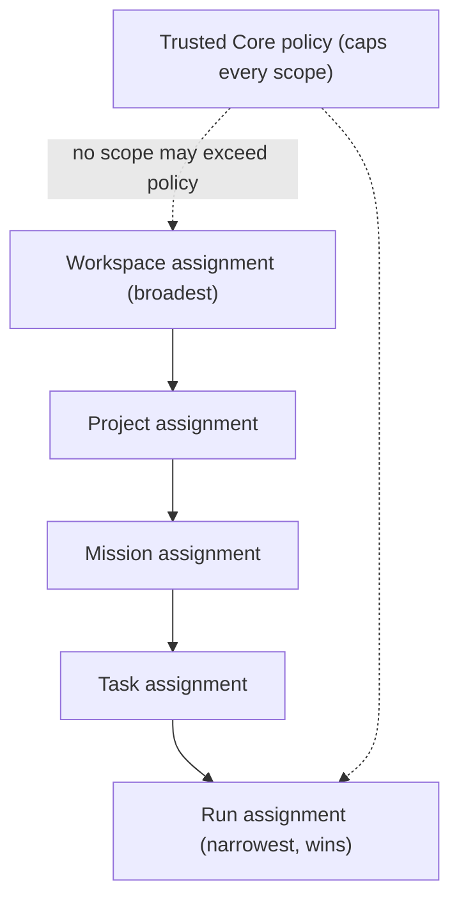

# AI Crew and Assignment Model

**Status:** Adopted for S0-B (2026-07-20); role and lineup **vocabulary is
Provisional** pending usability evidence. Documentation only — no agent
runtime, orchestration, provider, or model integration is authorized.

## 1. Model / Provider / Role / Agent / Assignment

- **Model** — an intelligence engine (reasoning capability).
- **Provider** — an **execution and data-routing boundary**: the actual
  destination of prompts, context, and outputs, with its own retention and
  training posture. The same model behind two providers is two different
  data-routing decisions.
- **Role** — a responsibility (what an actor is accountable for).
- **Agent** — a **binding** of a role to: a model, a provider, tools,
  context, permissions, and budgets.
- **Assignment** — a **binding** of an agent to a scope (workspace /
  project / mission / task / run).

Required semantics:

- assignments may be **overridden at narrower scopes** (a run-level
  assignment overrides a project-level one) but never widen authority
  beyond policy;
- **fallback must never silently switch provider or data routing** — a
  routing change is always explicit and re-authorized;
- **privacy classification constrains eligible providers and models**: a
  higher-classification context reduces the eligible set, and an ineligible
  provider is simply unavailable, not silently substituted.

## 2. Assignment hierarchy

Narrower wins for **selection**; policy always caps **authority**. An
assignment can restrict but never exceed what the trusted core permits for
that actor and scope.

## 3. Studio Crew (provisional roles)

Human Director; Mastermind / Coordinator; Product Strategist; Architect;
Researcher; Builder; UI Specialist; Reviewer; Test Specialist; Security
Specialist; Documentation Specialist; Delivery Specialist.

- The **Human Director** is above every role.
- The **Mastermind coordinates but possesses no unrestricted effect
  authority** — it proposes plans and actions that flow through the same
  approval and capability gates as any other actor.

## 4. Crew configuration

- Assignments at **workspace, project, mission, task, and run** level.
- **Drag-and-drop** configuration; **quick assignment**;
  **natural-language assignment proposals that require confirmation**
  (a proposal is never self-applied).
- **Suggested crews with explicit reasons** (the product must say *why* a
  crew is suggested).
- **Saved lineups** (provisional vocabulary): Solo Builder; Secure
  Development; Research Lab; UI Studio; Release Room.

## 5. Coordination modes (provisional)

| Mode | Meaning |
| --- | --- |
| Single Mastermind | one coordinator sequences the crew |
| Mastermind plus Reviewer | coordination with a mandatory reviewing role |
| Council | multiple roles deliberate before proposing |
| Human-led | the Director coordinates directly |

None grants any role unrestricted authority; all effects pass the same
gates.

## 6. Autonomy levels (exact, bounded — no unrestricted level)

| Level | Name | What the actor may do |
| --- | --- | --- |
| 1 | Observe | read within its context; no proposals of effects |
| 2 | Suggest | propose plans/actions; no preparation of effects |
| 3 | Prepare | stage reversible artifacts (e.g. a diff) for review; apply nothing |
| 4 | Execute with approval | apply a specific effect only after the required approval |
| 5 | Execute within a contract | apply effects strictly inside a Work Contract's scope, tools, paths, time, cost, provider, and classification, with contracted evidence |

There is **no level 6 / unrestricted-control level.** Even level 5 is
bounded by the contract and by trusted-core capabilities, and remains
pausable, cancellable, and reversible by the Director.

## 7. How constraints apply

Every autonomy level is further bounded by: **permission scope** (which
capabilities), **tool scope** (which tools), **path scope** (which files),
**time** (wall-clock limits), **cost** (token/money budgets),
**provider** (which routing boundary), and **data classification** (which
providers/models are even eligible). Exceeding any bound halts the run
fail-closed; it does not silently downgrade or reroute.

## 8. Review requirements and Mastermind limitations

- Sensitive change classes require review before approval; an actor never
  provides the sole approval for its own restricted action (separation of
  duties, from S0-A).
- The **Mastermind** may plan and coordinate but cannot merge, release,
  manage membership/permissions, permanently delete, or grant itself
  authority. It is an untrusted actor like the rest of the crew, with a
  coordination responsibility — not a superuser.

> **UI-zero-authority (cross-cutting):** the crew and assignment surfaces present and request; no UI element and no agent holds enforcement authority. The trusted core authorizes every effect.
