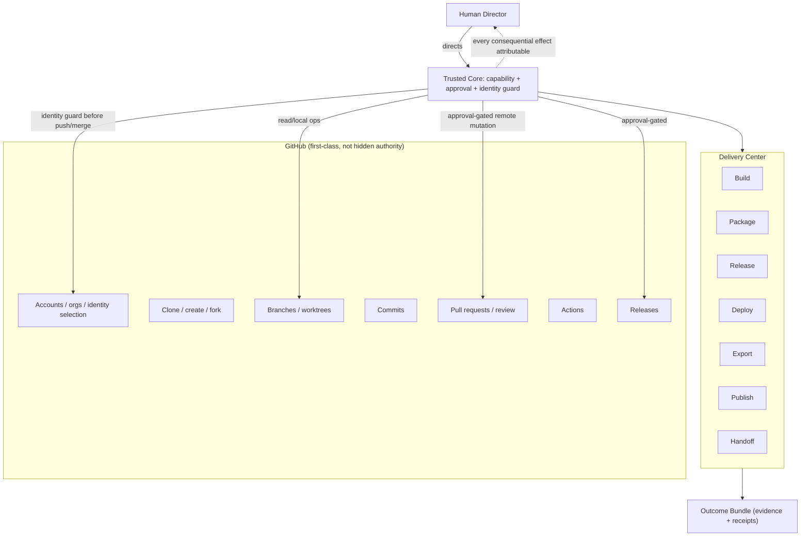

# GitHub and Delivery Boundaries

**Status:** Provisional (2026-07-20). Documentation only — **no** GitHub
API design or integration, and **no** Delivery Center implementation, is
authorized. Defines future product responsibilities and permission
boundaries.

## 1. GitHub is first-class but never a hidden authority

GitHub is a first-class integration, but it is **not** an authority path
that can bypass the human. Every consequential remote mutation (push,
merge, release, delete) requires **human approval** and passes the same
trusted-core capability and approval gates as any local effect. An
**identity guard** confirms *which* account/identity is about to act
before any push or merge.

## 2. GitHub and Delivery flow

## 3. GitHub product boundaries (future responsibilities)

- **Multiple accounts and organizations**; account/identity selection made
  explicit and visible (status bar shows the active GitHub identity).
- **Repository** clone / create / fork; **branch** and **worktree**
  handling; **commits**.
- **Pull requests**; **review**; **Actions**; **releases**.
- **Identity guard** before push or merge; **human approval** for
  consequential remote mutations.
- Read and local operations may be lower-friction; remote-mutating and
  irreversible operations are always gated.

No API surface, token handling, or integration mechanism is designed here.

## 4. Delivery Center

Defines these activities as product concepts: **Build, Package, Release,
Deploy, Export, Publish, Handoff.** Each consequential delivery action is
capability- and approval-gated; none is a hidden authority. Final
packaging formats and delivery logic are **not** defined or implemented.

## 5. Outcome Bundle

An **Outcome Bundle** is the assembled, evidenced result of a mission,
suitable for handoff. Where applicable it contains: source; build outputs;
documentation; tests; evidence; deployment material; checksums; decisions;
receipts; and a `HANDOFF.md`. It is verifiable against the run evidence
that produced it. This document defines the **concept**, not a file
format or a builder.

## 6. Evidence and receipts

Consequential delivery and remote actions produce **receipts** (what was
done, by whom/what, under which approval and identity) that join the
mission's evidence. Receipts and evidence are attributable and retained;
they are how the Director later answers "who or what caused this effect."

## 7. Scope of this document

Product boundaries and permission gates only. It authorizes **no** GitHub
API integration, credential handling, Actions/release automation, Delivery
Center implementation, packaging, signing, or deployment. Those are gated
behind separate, later authorization.

> **UI-zero-authority (cross-cutting):** GitHub and Delivery views present and request; the trusted core (with the identity guard and approval gates) is the authority. The UI is never a remote-mutation authority.
