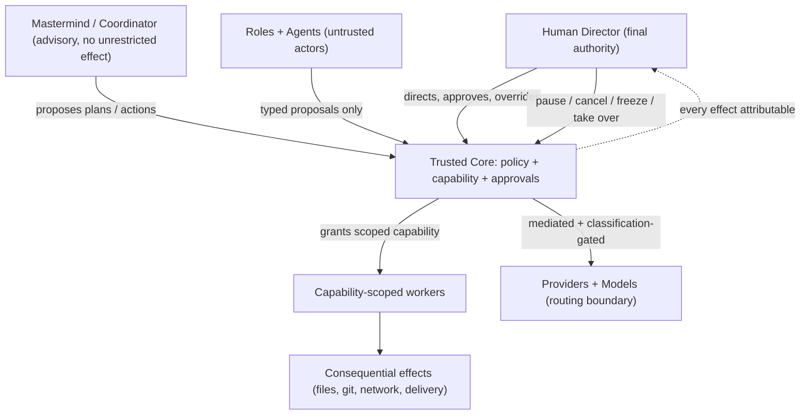

# Human-Centred Control Model

**Status:** Adopted for S0-B (2026-07-20). Documentation only. Refines,
never weakens, the S0-A Security Constitution and Capability Model.

## 1. Director authority

The human is the **Director** and the final authority over WePLD. No
Mastermind, model, agent, provider, plugin, or integration is above the
human. Concretely, the Director must always be able to:

- understand what is happening (legibility);
- approve or deny consequential actions;
- pause all work; resume work;
- cancel a mission;
- freeze a workspace;
- take control (take over an agent/run);
- inspect changes;
- reject or accept individual changes;
- restore a checkpoint;
- reassign work;
- change scope, model, budget, or permissions;
- inspect who or what caused every consequential effect.

These are **product invariants**: a design that removes any of them is a
defect, regardless of convenience.

## 2. Human-authority hierarchy

The Mastermind sits **below** the human and **beside** the other roles as
a coordinator; it never gains unrestricted effect authority. Authority
flows only through the trusted core, never through the UI or an agent.

## 3. Approval model

Every consequential action carries an **approval class** (from the S0-A
model), surfaced in the product as an explicit decision the Director can
read and act on. Classes range from *no approval* (safe, reversible,
in-scope) through *single human approval*, *elevated approval*, *dual
control*, up to *impossible by policy*. The product must show, for each
pending action: the actor, the requested capability, the resource/scope,
the expected effect, and a **damage-radius** estimate. Approval is
per-action and per-scope; approving one action never implicitly approves
another.

## 4. Pause, cancel, freeze, take over

| Control | Meaning | Guarantee |
| --- | --- | --- |
| Pause | halt further effects; keep state | resumable; no new effects while paused |
| Resume | continue after pause | only from a consistent state |
| Cancel mission | stop a mission | no further effects; evidence retained |
| Freeze workspace | emergency stop for a whole workspace | suspends all capability use in scope |
| Take over | convert an agent run to a human session | agent capabilities revoked on takeover |
| Reassign | move work to another human/agent | new actor, fresh capabilities |

These map to trusted-core actions; the UI merely requests them. Freeze is
the product face of the S0-A emergency control and outranks every grant.

## 5. Damage-radius review

Before a consequential action, the product presents a **damage-radius
view**: which files, paths, branches, remotes, budgets, and data
classifications the action could affect, and whether it is reversible.
The Director reviews and accepts or rejects — individually where changes
are separable (accept/reject per change), not just in bulk.

## 6. Checkpoints and restoration

Work produces **checkpoints** the Director can inspect and **restore**.
Restoration is visible and explicit; the product must show what a restore
would change before it happens. Destructive actions prefer soft-delete and
retention; irreversibility is a last resort with explicit confirmation.

## 7. Explainability

For every allowed or denied action, the product shows a **human-readable
explanation**: a machine reason code plus an understandable sentence
(e.g. `DENIED — git-metadata-access-rejected`). Explanations are
deterministic and sanitized: they never leak secrets or environment
values, and never render `undefined`, `null`, or a raw object.

## 8. Denial and recovery UX

The product distinguishes four outcomes clearly and never conflates them:
**success**, **denial** (policy said no), **failure** (it went wrong), and
**unavailable** (a dependency such as the core is down). Requirements:

- explicit **core-unavailable** state and a **Restart Core** control
  (from S0.5A: no always-on auto-restart is assumed; the human sees and
  triggers recovery);
- a **details** view for any outcome;
- **safe retry** semantics (retry only when the prior attempt left no
  partial effect, or after explicit reconciliation);
- checkpoint/restoration visibility;
- **no false-success**: an operation is reported successful only when
  verified.

## 9. Progressive disclosure

Powerful tools remain available but do not crowd the default view.
Complexity appears when relevant to the current mission/layout. Beginner
usability must not remove expert capability; expert capability must not
overwhelm ordinary workflows. This is an accessibility and safety
requirement, not merely aesthetics.

## 10. Accessibility and RTL

Accessibility is **architecture**: full keyboard operation, screen-reader
labels and result announcements, visible focus, logical order, text
scaling, high contrast, and reduced-motion are required across the
product. **Arabic and right-to-left layout are first-class**, including
bidirectional text and mirrored layout. (S0.5A gathered founder-manual
Windows accessibility evidence only; production UI is more complex and
must be retested, and macOS/Linux remain untested.)

## 11. Safeguards against automation theatre and false success

The product must not simulate control it does not have. Progress
indicators reflect real state; "done" reflects verified completion;
approvals are real gates, not decorative confirmations; and any action the
core did not actually authorize is never shown as if it succeeded. The
control surfaces in this document are only meaningful because the trusted
core enforces them — the UI presents them, it does not fake them.

> **UI-zero-authority (cross-cutting):** every control above is a request from the interface; the trusted core is what actually stops, denies, or permits. The UI never enforces.
