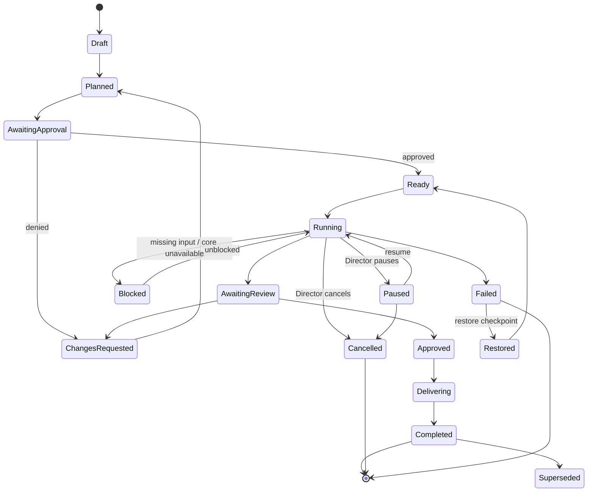

# Mission and Run Lifecycle

**Status:** Adopted for S0-B (2026-07-20). A **conceptual state model** —
not an executable workflow engine. Documentation only.

## 1. States

| State | Meaning |
| --- | --- |
| Draft | mission being defined; no Work Contract finalized |
| Planned | a plan exists; not yet approved |
| Awaiting Approval | plan or a consequential step awaits human approval |
| Ready | approved and authorized to run |
| Running | one or more runs are executing under scoped capabilities |
| Paused | halted by the Director; resumable; no new effects |
| Blocked | cannot proceed (missing input, dependency, or unavailable core) |
| Awaiting Review | results/changes await review |
| Changes Requested | reviewer returned it for rework |
| Approved | changes accepted |
| Delivering | Delivery Center is producing an Outcome Bundle |
| Completed | verified outcome; evidence retained |
| Cancelled | stopped by the Director; terminal; evidence retained |
| Failed | ended in error; terminal for this attempt; evidence retained |
| Restored | resumed from a checkpoint |
| Superseded | replaced by a newer mission/version, with a link |

## 2. Lifecycle diagram

## 3. Legal transitions and human authority

- Every transition into a consequential state (Ready, Running, Delivering)
  requires the appropriate **approval class**; the human authorizes it.
- The Director may force **Paused**, **Cancelled**, or a workspace
  **freeze** from any active state.
- No transition to **Completed** occurs without satisfying the Work
  Contract's acceptance criteria and required reviews (**no
  false-success**).
- Denials route to **Changes Requested**, not silent continuation.

## 4. Checkpoints, retries, cancellation, failure

- **Checkpoints** are taken at meaningful boundaries; **Restored**
  re-enters at **Ready** with a fresh authorization.
- **Retries** are safe-only: a failed run retries only if it left no
  partial effect, or after explicit reconciliation. Reruns record a
  reason; they never erase prior evidence.
- **Cancellation** and **Failure** are terminal for the attempt, contain
  effects, and retain evidence; neither is reported as success.

## 5. Handoff and evidence retention

A mission that reaches **Delivering/Completed** produces an **Outcome
Bundle** (`GITHUB-AND-DELIVERY-BOUNDARIES.md`) whose evidence is retained
and attributable to the runs that produced it. Evidence for Cancelled and
Failed missions is also retained — honest failure is preserved, not
discarded.

## 6. Not an engine

This is a **conceptual** lifecycle: allowed states and transitions and the
human's authority over them. It defines **no** executable workflow engine,
scheduler, persistence, or orchestration runtime; those are gated behind
S1.

> **UI-zero-authority (cross-cutting):** the UI presents lifecycle state and requests transitions; the trusted core authorizes them. No UI element advances a mission on its own authority.
