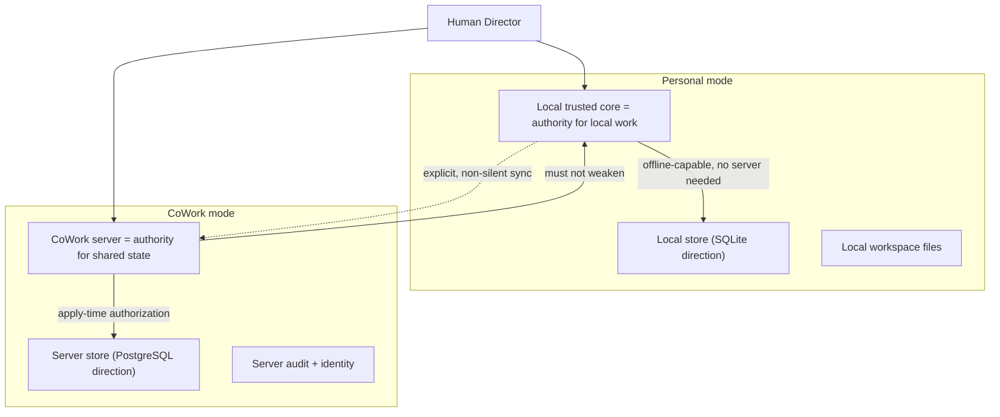

# Personal and CoWork Boundary

**Status:** Adopted for S0-B (2026-07-20); CoWork **detail is Deferred**
and CoWork implementation is **not authorized**. Documentation only — no
database schemas or synchronization algorithms.

## 1. Two modes, one guarantee floor

**Personal** and **CoWork** are distinct modes, not one with networking
bolted on. CoWork adds shared, server-mediated collaboration; it may add
constraints but **must never weaken a Personal-mode guarantee** (human
final authority, UI-zero-authority, no ambient authority, no silent
routing, legibility, reversibility).

## 2. Authority boundary

## 3. Local authority (Personal)

- The **local trusted core** is the authority for local work; **no server
  authority is required**.
- Works **offline**; **no account required** for founder-controlled local
  mode.
- Local persistence direction: **SQLite** (provisional); workspace files
  on the local disk; secrets via the OS secret mediator.

## 4. Server authority (CoWork)

- The **CoWork server** is authoritative for **shared** state.
- Server persistence direction: **PostgreSQL** (future).
- **Identity, permissions, synchronization, audit, and conflict handling
  are explicit** and server-enforced.
- Client-side checks are UX; **server-side authorization at apply time is
  the real gate** — an offline client cannot grant itself shared
  authority.

## 5. Identity, sync, permissions, audit, conflicts, offline

| Concern | Personal | CoWork (deferred detail) |
| --- | --- | --- |
| Identity | local user; no account required | server identities and devices |
| Permissions | local core capabilities | server-enforced roles + capabilities |
| Sync | none required | explicit, non-silent, server-authorized |
| Audit | local evidence ledger | server audit + local anchoring |
| Conflicts | single-writer local | explicit conflict handling (model deferred) |
| Offline | full capability | queue; applied only on server acceptance |

## 6. Data ownership and privacy

Personal data stays on the user's device unless the Director explicitly
configures cloud/CoWork routing. **Cloud and cross-user routing are never
silent.** Privacy classification constrains which providers, models, and
CoWork destinations are even eligible for a given context.

## 7. Migration direction

Moving a project from Personal to CoWork is an explicit, human-authorized
migration that adds server authority **without** dropping Personal
guarantees. The migration model detail is **Deferred**.

## 8. Invariants CoWork must not weaken

1. Human final authority and UI-zero-authority.
2. No ambient authority; explicit capabilities and approvals.
3. No silent provider or data-routing changes.
4. Understandable denial/failure/unavailable states; no false success.
5. Evidence and attributability of consequential effects.
6. Local-first capability of Personal mode remains intact.

## 9. Scope of this document

Defines the *boundary and invariants* between modes. It defines **no**
database schema, sync algorithm, CRDT/OT choice, authentication mechanism,
or server implementation; CoWork is gated behind separate, later
authorization.
