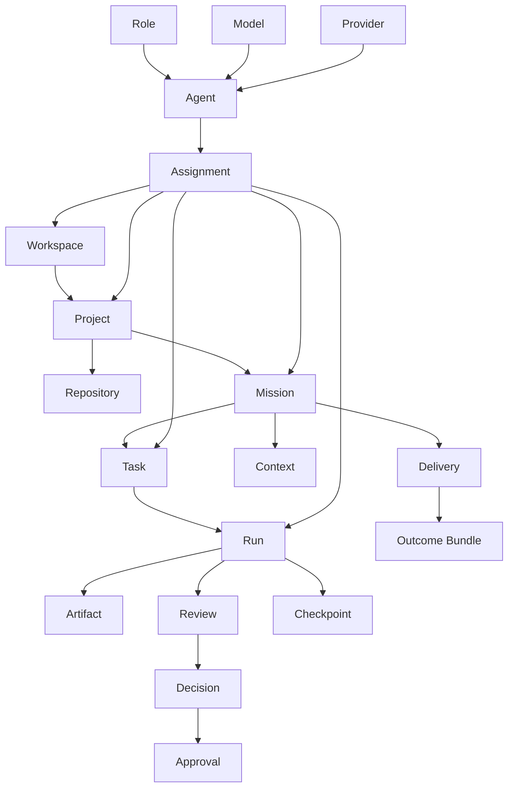

# Product Domain Model

**Status:** Adopted for S0-B (2026-07-20). **Conceptual only** — this
document defines product entities, relationships, and invariants. It does
**not** define storage tables, ORM models, JSON schemas, or APIs.

## 1. Entities

| Entity | Definition |
| --- | --- |
| Workspace | Top-level container the Director owns; groups projects, crew, providers, budgets, and a security profile. |
| Project | A unit of work inside a workspace; groups repositories, missions, context, and artifacts. |
| Repository | A source repository (local and/or GitHub) a project works with. |
| Mission | A human-defined intent with a Work Contract; the unit that moves from intent to verified outcome. |
| Task | A decomposed piece of a mission, assignable to a human or agent. |
| Run | A single bounded execution attempt of a task by an actor, under scoped capabilities. |
| Model | An intelligence engine (the reasoning capability). |
| Provider | An execution and data-routing boundary that serves models; where data actually goes. |
| Role | A named responsibility (e.g. Builder, Reviewer). |
| Agent | A binding of a role to a model, provider, tools, context, permissions, and budgets. |
| Assignment | A binding of an agent to a scope (workspace/project/mission/task/run). |
| Context | The curated inputs an actor may use (files, docs, prior decisions), bounded by classification. |
| Artifact | A produced output (code, document, build output, evidence). |
| Review | A human or role evaluation of proposed changes or results. |
| Decision | A recorded, attributable choice (e.g. approve a plan, accept a change). |
| Approval | An authorization of a specific consequential action at a specific scope. |
| Checkpoint | A restorable snapshot of relevant state. |
| Delivery | A packaging/release/handoff activity in the Delivery Center. |
| Outcome Bundle | The assembled, evidenced result of a mission suitable for handoff. |

## 2. Relationship diagram (conceptual)

## 3. Model / Provider / Role / Agent / Assignment (kept distinct)

These five are **never conflated**:

- **Model** = the intelligence engine.
- **Provider** = the execution and **data-routing boundary** (the place
  data is actually sent). Two providers may serve the same model with
  different data-routing and retention.
- **Role** = the responsibility (what job this actor is accountable for).
- **Agent** = role **bound to** a model, provider, tools, context,
  permissions, and budgets.
- **Assignment** = agent **bound to** a scope; narrower assignments may
  override broader ones, but never widen authority beyond policy.

Full semantics: `AI-CREW-AND-ASSIGNMENT-MODEL.md`.

## 4. Invariants

1. Every consequential **Artifact/effect** traces to a **Run**, an
   **Agent** (or human), an **Assignment**, and an **Approval** where the
   action's class requires one.
2. A **Run** executes only under capabilities the trusted core granted for
   its scope; it holds no ambient authority.
3. **Context** never exceeds the run's data-classification ceiling, and
   the eligible **Providers/Models** are constrained by that
   classification.
4. A **Mission** cannot reach a completed outcome without satisfying its
   Work Contract's acceptance criteria and required reviews.
5. **Decisions** and **Approvals** are append-only and attributable; they
   are not silently rewritten.
6. A **Checkpoint** is restorable and its restore effect is previewable.
7. An **Outcome Bundle** references, and is verifiable against, the
   evidence of the runs that produced it.
8. **Provider/data-routing** for any run is explicit; it is never changed
   silently by fallback.
9. The **UI** holds none of this authority; it presents and requests only.

## 5. What this document deliberately omits

No physical schema, no field types, no primary/foreign keys, no ORM, no
JSON Schema, no API endpoints, no persistence engine choices beyond the
already-stated *directions* (SQLite local / PostgreSQL server). Those are
implementation concerns gated behind S1.
