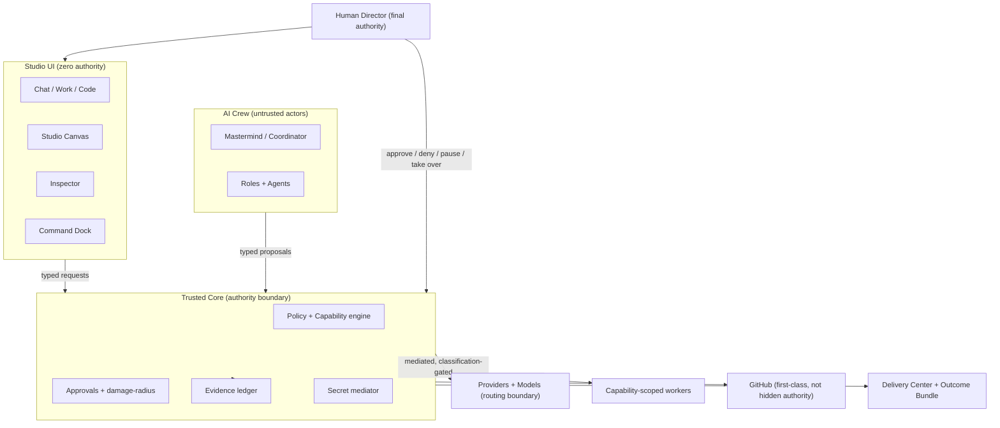

# S0-B — WePLD Product Architecture

**Status:** Adopted for S0-B (founder decision, 2026-07-20). Documentation
only; authorizes no implementation. Inherits all S0-A constitutions and
the S0.5A Windows-scoped ratification without weakening them.

## 1. What WePLD is

WePLD is a **Local-first AI Development and Computer Control Studio**: a
desktop studio in which a human **Director** commissions and supervises a
crew of AI roles and agents that perform real software and computer work —
under explicit authorization, on the user's own machine first, with the
cloud optional and never silent.

The human is the **Director and final authority**. Every AI role, agent,
provider, plugin, and integration operates below the human, inside
explicit capabilities and approvals. WePLD's job is to make powerful
autonomous work **legible, authorized, observable, and reversible** — not
to replace the human's judgment.

## 2. Product promise

> **You direct. Your AI studio works. WePLD keeps you in control.**

Wording may be refined; the meaning is fixed: the human directs; the AI
studio does the work; control never leaves the human.

## 3. Target users

- **Primary (now):** the founder, operating a founder-controlled Windows
  Personal Alpha.
- **Adopted direction:** individual developers and technical creators who
  want autonomous AI development they can actually supervise.
- **Future (CoWork):** small collaborating teams of humans and agents.
- Progressive disclosure (§8) serves beginners without removing expert
  capability.

## 4. Product modes

**Personal** — local-first; works offline; no account required for the
founder-controlled local mode; SQLite is the provisional local persistence
direction; local models via Ollama or equivalent; cloud models optional
and explicitly configured; **cloud routing is never silent**; no server
authority is required for local work.

**CoWork** — humans and agents collaborate; **server-side authority is
required**; PostgreSQL is the future server-side persistence direction;
permissions, synchronization, audit, identity, and conflict handling are
explicit; **CoWork must not silently weaken any Personal-mode guarantee**;
CoWork implementation is **not** authorized by S0-B. Detail lives in
`PERSONAL-AND-COWORK-BOUNDARY.md`.

## 5. Product surfaces (overview)

The Studio is organized into: three top-level modes (**Chat / Work /
Code**), a **left navigation**, a central **Studio Canvas**, a right
**Inspector**, a bottom **Command Dock**, and a **status bar**, arranged
into purpose-oriented **layouts**. All of these **present and request**;
none holds security authority (UI-zero-authority). Full detail:
`STUDIO-INFORMATION-ARCHITECTURE.md`.

## 6. Product system map

## 7. End-to-end journey (direction, not a claim of implementation)

Install → choose Personal or CoWork → select a security profile → run
**Environment Doctor** → connect GitHub and optional providers → create or
open a **Workspace** → create or open a **Project** → select an outcome
blueprint → inspect the **project map** → define a **Mission** and **Work
Contract** → assign the **Crew** → execute human and agent work → observe
progress → review changes and **damage radius** → approve Git/GitHub
operations → collaborate through CoWork where applicable → use **Delivery
Center** → produce an **Outcome Bundle** → preserve evidence and handoff
material. Not all steps are implemented; this is the intended arc.

## 8. Architecture principles

1. **Human is final authority** over every consequential effect.
2. **UI-zero-authority** — the interface never enforces; the trusted core
   does.
3. **No ambient authority** — every effect needs an explicit, scoped,
   expiring capability (S0-A Capability Model).
4. **Legibility** — the human can always understand what is happening and
   why an action was allowed or denied (human-readable authorization).
5. **Local-first** — Personal mode works fully offline; the cloud is
   optional and **never silent**.
6. **No silent routing** — provider or data-routing changes are always
   explicit and classification-gated; fallback never silently switches
   provider or routing.
7. **Reversibility** — checkpoints, soft actions, and restoration over
   irreversibility; no false-success states.
8. **Evidence** — consequential effects are attributable and auditable.
9. **Progressive disclosure** — powerful tools stay available; complexity
   appears only when relevant; beginner usability never removes expert
   capability, and expert power never overwhelms ordinary workflows.
10. **Accessibility is architecture** — keyboard, screen-reader, and
    **Arabic/RTL** support are first-class, not polish.
11. **Proprietary, closed-source** posture (inherited).

## 9. Boundaries

- The UI proposes; the **trusted core** authorizes; **workers** execute
  under scoped capabilities; **providers** are a mediated routing boundary.
- **Mastermind coordinates but holds no unrestricted effect authority.**
- **GitHub is first-class but never a hidden authority**; consequential
  remote mutations require human approval
  (`GITHUB-AND-DELIVERY-BOUNDARIES.md`).
- **CoWork adds server authority but may not weaken Personal guarantees.**

## 10. Open questions (see the register for full treatment)

Cross-platform UI beyond Windows Personal Alpha; final Studio layout
inventory; role vocabulary; coordination-mode defaults; provider-routing
UX; CoWork conflict model; plugin/updater/external-distribution timing.
Each is classified in `S0-B-DECISION-AND-ACCEPTANCE-REGISTER.md`.

## 11. Explicit non-goals (this package does NOT authorize)

Rust product implementation; Tauri product shell; React/TypeScript UI;
Studio Shell; database schemas; SQLite or PostgreSQL implementation; sync;
authentication; CoWork implementation; provider or model integrations;
agent or orchestration runtime; GitHub API integration; Delivery Center
implementation; updater; plugins; installer; signing; packaging;
deployment; telemetry; cloud infrastructure; Package A; Evaluation Spine;
official EvaluationRun; Native Delivery V0; and **S1**. No S0.5A prototype
code is reused.
