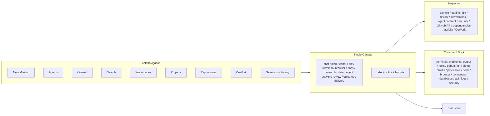

# Studio Information Architecture

**Status:** Provisional (2026-07-20). The *structure* is adopted as
direction; specific layouts, view inventories, and vocabulary need
usability evidence before they are final. Documentation only — no React,
HTML, CSS, TypeScript, or design files. **UI-zero-authority** governs
every element here: all surfaces present and request; none enforces.

## 1. Top-level modes

- **Chat** — conversational direction and clarification with the crew.
- **Work** — mission/task/run supervision and review.
- **Code** — editor/diff/terminal-centred development.

Modes are lenses over the same underlying domain (missions, runs,
artifacts); switching a mode never changes authority.

## 2. Studio information architecture map

## 3. Left navigation

New Mission; Agents; Context; Search; Workspaces; Projects; Repositories;
CoWork; Sessions and history. Navigation reflects the domain model
(`PRODUCT-DOMAIN-MODEL.md`); selecting an item changes what is shown, not
what is permitted.

## 4. Studio Canvas

The central canvas may present and combine: chat, plan, editor, diff,
terminal, browser, documents, research, data, agent activity, review,
outcome, and delivery. It supports **tabs, splits, and layout changes**.
Because of UI-zero-authority, a terminal or browser view in the canvas is
a **presentation** of a capability-scoped worker's activity — the canvas
does not itself execute privileged operations; it requests them from the
trusted core and displays results.

## 5. Right Inspector

Context; outline; diff; review; permissions; agent contract; security;
GitHub pull request; dependencies; activity; CoWork. The Inspector is
where the Director reads *why* — permissions, the agent's contract, the
security posture, and the damage radius of a pending action.

## 6. Command Dock

A customizable bottom dock: Terminal; Problems; Output; Tests; Debug; Git;
GitHub; Tasks; Processes; Ports; Browser; Containers; Databases; API;
Logs; Security. Docked tools surface the state of capability-scoped
workers and integrations; they never become an authority path.

## 7. Status bar

Workspace; project; repository and branch; GitHub identity;
model/provider; active security profile; CoWork and sync state; active
agents; budget/cost state. The status bar keeps the Director continuously
aware of *who is acting, where, under what routing, and at what cost*.

## 8. Layouts

Purpose-oriented layouts: **Coding, Research, Review, Debug, Security,
CoWork, Delivery.** A layout arranges the canvas, inspector, and dock for
a task class. Layouts are **Provisional** — the final set and defaults
require usability evidence.

## 9. View composition, navigation hierarchy, context preservation

Views compose via tabs and splits; the navigation hierarchy is
Workspace → Project → Repository/Mission → Task/Run. Switching views or
layouts **preserves context** (the active mission, selection, and scope)
so the Director never loses their place. History and sessions make prior
work retrievable.

## 10. Progressive disclosure

Default views stay simple; advanced panels (permissions internals, raw
logs, provider routing detail, security internals) are available on
demand. Complexity appears when a mission or a pending approval needs it.

## 11. Accessibility and responsive principles

Keyboard-first operation; screen-reader semantics and announcements;
visible focus; logical tab order; text scaling; high contrast;
reduced-motion; and **Arabic/RTL** as first-class (mirrored layout, bidi
text). Responsive principles: the layout adapts to window size and
density without hiding safety-critical controls (approvals, pause,
freeze, core-unavailable/restart).

## 12. UI-zero-authority boundary (restated)

No canvas view, inspector panel, dock tool, status element, or layout ever
holds filesystem, shell, network, secret, database, policy, capability,
ledger, provider, update, or agent-execution authority. Every effect is a
typed request to the trusted core, authorized there, and merely reflected
back to the UI.
