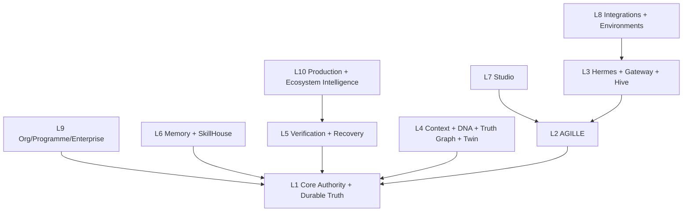
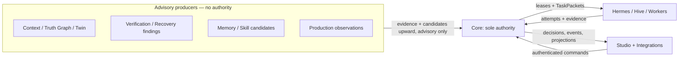

# WePLD Product Architecture Map

**Standing:** planning only; nothing here authorizes implementation.

## Layered architecture — five distinct flows

One diagram cannot honestly carry dependency, authority, command, evidence,
and learning at once, so they are separated. Rules that hold across all five:
code dependencies point downward only; **authority always terminates at Core
and authenticated principals**; commands move from Studio/integrations toward
Core, which authenticates and records them; evidence flows upward as advisory
input only; production feedback creates candidates, never direct policy;
recovery observations trigger Core-recorded reconciliation; advisory
information flow is never authority. Neither Layer 10 nor Studio can mutate
durable truth directly — every mutation is an authenticated Core command.

**View 1 — module/source dependency direction** (build-time; downward only):

**View 2 — authority, command, evidence, and learning flows** (runtime):

| Flow | Direction | Rule |
| --- | --- | --- |
| Module dependency | downward only | higher layers import lower contracts, never the reverse |
| Authority | terminates at Core | only authenticated principals decide; no advisory layer decides |
| Runtime commands | inward to Core | Studio and integrations submit; Core authenticates, records, executes via the Effect Firewall |
| Event/evidence | outward/upward as data | findings, observations, and telemetry become evidence candidates — never instructions |
| Feedback/learning | upward as candidates | production and feedback create MemoryCandidates/requirement proposals; admission is judged, never automatic |

| Layer | Owner | Trusted inputs | Typed outputs | Prohibited responsibilities | Security boundary | Degradation behavior |
| --- | --- | --- | --- | --- | --- | --- |
| 1. Core authority + durable truth | WePLD Core | authenticated commands; validated artifacts | events, decisions, artifacts, evidence, capabilities | reasoning, retrieval, UI, provider calls | identity + Policy/Capability Engines + Effect Firewall | refuse and record; never guess; `Uncertain` is first-class |
| 2. AGILLE delivery orchestration | AGILLE engine (in Core's trust domain) | approved specs/contracts/plans; Core state | phase/task transitions, TaskPackets, proposals | approving its own artifacts; executing effects | all transitions are Core-recorded | halt the lifecycle honestly (`Blocked`/`Deferred`), never skip gates |
| 3. Hermes + Universal Agent Gateway + Agent Hive | Hermes runtime | TaskPackets, ContextPacks, capability manifests | proposals, edits-in-worktrees, evidence, typed results | durable truth, approvals, ungoverned effects | leases + manifests + sandbox + Effect Firewall | a failed worker/provider yields a failed/uncertain attempt, never promoted |
| 4. Context, Project DNA, Truth Graph, Digital Twin | Context/knowledge services | repository, ledger, LSP, Git evidence | ContextPacks, graphs, projections (hashed) | inventing facts; becoming authority; unredacted egress | projection + redaction + classification | fall back to smaller exact context; record exclusions |
| 5. Verification, assurance, recovery | Evidence/assurance + recovery services | attempts, artifacts, deterministic tool output | findings, gaps, gate results, reconciliations | accepting completions; hiding failures | deterministic inspectors; model claims need evidence links | missing evidence = gap reported, never assumed green |
| 6. Memory, SkillHouse, governed learning | Memory Judge + Skill registry | verified mission evidence, candidates | admitted memory, evaluated Skills, learning episodes | self-promotion; auto-injection into authority paths | candidate → judge → scoped retrieval only | learning off = system still fully functional |
| 7. Studio | Studio surfaces | Core projections only | user commands to Core | owning state; bypassing Core; hidden effects | rendered projections; decisions go through Core auth | read-only view loss only; truth undamaged |
| 8. Integrations + execution environments | adapters + runners | external tool output (untrusted), runner status | normalized typed evidence; contained execution | authority; unmediated effects; credential exposure | adapter contracts + sandbox + capability leases | integration loss = degraded evidence, honestly recorded |
| 9. Organization, programme, enterprise | enterprise services over Core | org policy, identities, delegations | scoped policies, delegations, audit projections | overriding project truth; silent cross-project access | tenant isolation; time-bounded delegation | org services down = single-project mode still works |
| 10. Production outcome + ecosystem intelligence | Production Truth Loop + registries | redacted telemetry, release evidence, registry data | outcome assessments, drift signals, trust records | raw sensitive telemetry to models; automatic rollback authority | observability redaction; authorization for any model exposure | no telemetry = release evidence stands alone, stated as such |

Dependency rule: higher layers depend downward only; Layer 1 depends on
nothing above it; Layers 4–6 are advisory producers whose outputs never carry
authority; Layer 7 is projection-only.

## Canonical ownership map (duplicate-engine prevention)

| Engine (single home) | Consumers (not owners) |
| --- | --- |
| Event ledger (Core) | Flight Recorder, time-travel replay, audit, Studio timelines |
| Constitution Compiler (Core) | Architecture Drift Radar, boundary checks, plan qualification |
| Verification Lab (L5) | Proof Gap Detector (component), Release Guardian, completion proposals |
| Flight Recorder (L5, ledger projection) | Recovery Room, replay, Incident Commander, postmortems |
| Truth Graph (L4) | Change Passport rendering, Ask Why, stakeholder views, Digital Twin |
| Project DNA (L4) | Constitution Compiler, Context Compiler, onboarding views |
| Digital Twin (L4, derived) | Mission Simulator/Decision Lab, impact analysis — **never** a source of truth |
| Change Passport (L5 record) | Release Guardian, audits, Truth Graph edges |
| CostRecord stream (Core) | Hermes cost/privacy routing (per-invocation) and Economics Engine (per-decision) — two consumers, one datum |
| Trust Registry (L10) | Committee reputation, profile certification, admission policy |
| Memory Judge (L6) | Engineering Memory admission/retrieval; Letta-derived candidates |
| SkillHouse registry (L6) | Skill Router, marketplace (later), DeepLearn candidates |
| Universal Agent Gateway (L3) | every provider, worker, human, external-agent, and Letta adapter |
| Decision queue (Core) | Decision Inbox, approval expiry, supersession |

## Exemplar full CapabilityRecords

Registry-wide defaults from the
[portfolio](WEPLD_Strategic_Capability_Portfolio.md) apply; only
distinguishing fields are shown.

### CAP-CORE-001 — WePLD Core

Category: Core authority service. Purpose: own durable engineering truth and
every authorization. User value: decisions and history that survive any model,
provider, or tool. Primary users: all. Problem solved: agent systems with no
durable, auditable truth. Inputs: authenticated commands, validated artifacts.
Outputs: events, decisions, capabilities, evidence records. Dependencies:
none above Layer 1. Prerequisite decisions: Stage 0 baseline settlement.
Failure modes: storage failure, crash mid-transaction. Recovery: transactional
ledger, idempotent replay (PR #1 pattern). Evaluation: EV-S1 vertical-slice
arms; ledger-integrity checks. Success: zero silent state loss; zero
unauthorized effects. Rejection path: none — this is the product; failure here
is program failure. V0: single-repo, single-user. Mature: multi-project,
organization, programme. Build/buy: **Build** (this is the moat).
Open-source: local Core open. Commercial: hosted coordination. Stage: 0–1.
Status: Planned (Draft PR #1 seed exists). Authorized: false.

### CAP-AGILLE-001 — AGILLE Delivery Engine

Category: AGILLE delivery service. Purpose: the governed method — charter →
specification → contract → qualified plan → phases → tasks → completion.
Problem solved: agents doing work without a method that produces evidence.
Authority owner: Core (AGILLE proposes transitions; Core records decisions).
Failure modes: gate skipped, stale plan. Recovery: staleness inspectors,
supersession. Evaluation: EV-S1/EV-S3 (specification-driven vs unstructured).
Rejection path: if governed delivery does not beat unstructured agents on
accepted-task success and false-completion rate, the method must be simplified
— the evaluation decides which ceremonies earn their cost. Build/buy: Build.
Open-source: the methodology itself is open. Stage: 1. Status: Planned.
Authorized: false.

### CAP-HERMES-001 — Hermes Engineering Intelligence Runtime

Category: Hermes runtime service. Purpose: supply intelligence and execution
capacity (kernel, skills, context, loops, subagents) under lease. Problem
solved: model capability without governance. Failure modes: provider loss,
malformed output, runaway loops. Recovery: bounded loops, watchdogs,
failed/uncertain attempts (PR #1 lifecycle). Evaluation: doc-34 harness arms.
Rejection path: any Hermes component that fails its ablation (e.g., a
retrieval mode, a loop policy) is disabled by task class. Build/buy: Build
core; integrate tools. Stage: 1–5. Status: Planned (seed exists). Authorized:
false.

### CAP-GATEWAY-001 — Universal Agent Gateway

Category: Hermes runtime service. Purpose: one neutral gateway for every
intelligence provider and engineering worker (model APIs, local models,
humans, external agents, optional Letta) speaking two open protocols.
Problem solved: provider lock-in and ad-hoc integrations. Security: identity
assurance per PR #3 `ModelIdentityEvidence`; capability manifests; egress
policy. Failure modes: provider drift, silent substitution (bounded assurance,
honestly recorded), health loss. Evaluation: EV-S10/EV-S13 provider arms.
Rejection path: an adapter class that cannot meet protocol conformance is not
admitted. Build/buy: Build protocols; wrap providers. Open-source: protocols +
reference adapters. Commercial: managed routing. Stage: 2. Status: Planned.
Authorized: false.

### CAP-COMMITTEE-001 — Engineering Committee

Category: Advisory deliberation system. As specified by PR #3 (docs 36–37,
ADR-0026) — adopted without redesign. Stage 6; gated by the doc-37 admission
rule. Rejection path: doc-37 rejection criteria. Status: Planned. Authorized:
false.

### CAP-TRUTH-001 — Engineering Truth Graph

Category: Context/knowledge system. Purpose: traceability and authoritative
relationships (charter↔spec↔contract↔plan↔task↔change↔evidence↔decision).
Problem solved: unanswerable "why does this exist". Data owner: derived from
Core stores; the graph is rebuildable, the ledger is truth. Failure modes:
staleness, wrong edges. Recovery: rebuild from ledger. Evaluation: EV-S8.
Rejection path: if graph-backed context does not reduce human corrections or
unsupported claims, it remains an internal index, not a product surface.
Build/buy: Build. Stage: 3. Status: Planned. Authorized: false.

### CAP-CONTEXT-001 — Context Compiler

Category: Hermes runtime service. Purpose: compile minimal, redacted, hashed,
per-audience ContextPacks with exclusion records and freshness. Problem
solved: context bloat, secret leakage, unexplainable model inputs.
Evaluation: EV-S7 + retrieval ablations (semantic retrieval admitted only
after beating exact/LSP/structural). Rejection path: any selection strategy
that loses to a simpler one is removed. Build/buy: Build (uses LSP Broker).
Stage: 3. Status: Planned. Authorized: false.

### CAP-VERIFY-001 — Verification Lab

Category: Evidence/assurance system. Purpose: one home for
claim-to-evidence mapping, acceptance coverage, proof-gap detection, evidence
freshness, and deterministic inspector orchestration. Problem solved: "done"
without proof. Failure modes: stale evidence, unmapped claims. Recovery:
gaps block completion proposals honestly. Evaluation: EV-S4/EV-S5.
Rejection path: inspectors with false-positive rates that exceed their
detection value are disabled per class. Build/buy: Build the lab; integrate
every mature tool. Stage: 4. Status: Planned. Authorized: false.

### CAP-RECOVER-001 — Flight Recorder + Recovery Room

Category: Recovery/operations system. Purpose: the ledger's operational
projection plus guided reconciliation (crash, uncertain effect, duplicate,
orphan, stale lock, interrupted provider). Problem solved: silent corruption
after failure. Evaluation: EV-S15 recovery drills (crash matrix). Rejection
path: a probe that cannot distinguish states stays manual. Build/buy: Build.
Stage: 4. Status: Planned (PR #1 recovery discipline is the seed).
Authorized: false.

### CAP-SKILL-001 — SkillHouse

Category: Registry + evaluation system (Commercial service at global tier).
Purpose: evaluated, versioned, signed reusable capability: project →
organization → certified global. Problem solved: unverified prompt/skill
sprawl. Security: poisoning defense, license analysis, revocation, no
self-promotion. Evaluation: EV-S9 (certified Skill vs none), canary use.
Rejection path: a Skill that does not generalize beyond its fixtures is not
promoted; the global tier does not open before certification foundations.
Build/buy: Build. Stage: 6/9. Status: Planned. Authorized: false.

### CAP-STUDIO-001 — Studio Mission Control

Category: Studio surface. Purpose: the governed cockpit — missions, decisions,
evidence, recovery — projections only. Problem solved: chat-window opacity.
Evaluation: EV-S16 decision-burden and surface-utility studies. Rejection
path: any surface less useful than an existing integration is dropped
(the doc's own criterion). Build/buy: Build (custom application; not
WordPress). Stage: 5. Status: Planned. Authorized: false.

### CAP-PTL-001 — Production Truth Loop

Category: Evidence/assurance system. Purpose: link released changes to
redacted production evidence and real Outcome Contract results; a green
release is not automatically a successful product outcome. Privacy: no raw
sensitive telemetry enters model context without authorization. Evaluation:
EV-S17. Rejection path: if outcome linkage cannot be established reliably for
a product class, the loop reports "unlinked" honestly instead of inventing
correlation. Build/buy: Integrate observability; Build the linkage. Stage: 7.
Status: Planned. Authorized: false.
