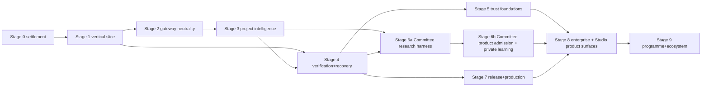

# WePLD Staged Delivery Roadmap

**Standing:** planning only. Every stage below remains unauthorized until its
gate is explicitly approved; a stage description is never permission to build.
Stages are dependency-driven, not date-driven, and map onto the existing H1–H9
gates of [22 — Milestones](../22_Milestones.md) rather than inventing a
competing numbering.

## H1–H9 mapping

| Stage | H anchor | Justification |
| --- | --- | --- |
| 0 | pre-H1 gates | Baseline Gate, ADR dispositions, ADR-0024 spine |
| 1 | H1–H2 | governed spec workflow + plan/builder separation |
| 2 | H2–H3 | gateway/protocols beside skill-runtime foundations |
| 3 | H4 | context/LSP/retrieval milestone carries project intelligence |
| 4 | H5 | loops/sandbox milestone carries verification + recovery |
| 5 | H6-era | trust-adoption and operator-workflow **foundations** only: CLI commands, structured JSON output, generated reports, typed query APIs, read-only evaluation artifacts — capability classes the canonical milestones already permit. **Studio product surfaces are admitted only at the canonical H9 gate** ([22 — Milestones](../22_Milestones.md): H8 closed, stable Core contracts, approved surface scope); any earlier GUI surface requires a formal amendment of document 22 through normal review (a named amendment candidate below), which this plan does not perform |
| 6a/6b | H6–H7 | Committee gate is H6 (ADR-0026); memory/learning is H7; research harness precedes product admission |
| 7 | post-H8 | release/production truth builds on certification-era evidence |
| 8 | post-H9 | enterprise/team; Studio product surfaces land here, behind the canonical H9 gate |
| 9 | post-H9 | programme/ecosystem |

## Stage dependency graph

No cycles: each stage consumes only earlier stages' exits — in particular, the
Committee **evaluation evidence is produced by Stage 6a's research harness**,
so Stage 6b's product-admission entry criteria are satisfiable rather than
self-referential. Stages 2/4 and 3/6a may overlap in calendar time but not in
gate order.

## Stage 0 — Architecture and baseline settlement

**Entry criteria:** Draft PRs #1–#3 at their frozen heads; validators green.
**Exit criteria:** independent review dispositions ADR-0015–ADR-0026; Build
Feature Baseline Gate resolved; authority contracts frozen; ADR-0024
Evaluation Spine operational. **Dependencies:** none. **User-visible value:**
none yet — honesty is the feature. **Technical acceptance:** doc validators +
spine fixtures green. **Security acceptance:** threat models reviewed.
**Evaluation:** n/a (settlement). **Rollback:** revise documents. **Excluded:**
all implementation. **Authorization gate:** founder + independent review
disposition every Proposed ADR.

## Stage 1 — Governed vertical slice (V0)

**Entry criteria:** Stage 0 exit. **Exit criteria:** the V0 journey (below)
passes on a fixture repo and one real bounded outcome with a terminal, honest
result. **Dependencies:** S0. **User-visible value:** one governed,
evidence-backed delivery. **Technical acceptance:** EV-S1 arms terminal;
deterministic gates; recovery drill passes. **Security acceptance:** worktree
confinement, payload bounds, Effect Firewall path (the PR #1 boundary suite)
green. **Evaluation:** EV-S1–EV-S5 baseline arms. **Rollback:** none needed —
single-slice. **Excluded:** Committee runtime, SkillHouse marketplace, Program
Mode, full IDE, autonomous merge, broad routing, global learning, production
orchestration. **Authorization gate:** explicit V0 implementation approval.

## Stage 2 — Provider and worker neutrality

**Entry criteria:** S1 exit. **Exit criteria:** Universal Agent Gateway with
capability handshake; two protocol families conformant; role isolation; one
external provider family admitted under policy; identity assurance recorded
per PR #3 contract. **Dependencies:** S1. **User-visible value:** choice of
runtime without governance change. **Technical acceptance:** conformance
tests; EV-S10/EV-S13 arms. **Security acceptance:** egress policy enforced;
no consumer-subscription pathway exists; credential boundary audited.
**Evaluation:** provider-neutrality arms. **Rollback:** disable an adapter
class by policy. **Excluded:** diversity-based routing (needs EC-A7/EC-A8
later), external coding-agent workers. **Authorization gate:** per-adapter
admission decision.

## Stage 3 — Project intelligence foundation

**Entry criteria:** S2 exit. **Exit criteria:** Project DNA + Constitution
Compiler emitting enforceable rules; Truth Graph v1; Context Compiler with
exact/LSP/structural selection, redaction, hashes, exclusions; Decision Inbox
queue in Core. **Dependencies:** S2 (packs travel through the gateway).
**User-visible value:** explainable context; "Ask Why" answers; fewer
irrelevant model inputs. **Technical acceptance:** retrieval ablations;
graph-rebuild-from-ledger drill. **Security acceptance:** assessed, terminal
evidence for every one of: imported-rule injection resistance (malicious
AGENTS.md/CLAUDE.md/Cursor-rule fixtures survive without becoming
instructions); repository instruction files remaining untrusted candidates;
`ConstitutionRuleCandidate` tampering detection (candidate-tampering
fixtures); context-poisoning resistance; cross-project and cross-tenant
context isolation (contamination fixtures); secret and sensitive-data
redaction tests; provider-specific projection integrity; projection-hash
verification (mismatch fixtures fail closed); candidate provenance and review
requirements (candidate-admission audit records exist for every admitted
candidate); deterministic-import kept separate from model-assisted
extraction; and proof that no imported candidate became policy, command
authority, capability, Specification, Plan, or Constitution rule
automatically. **Evaluation:** EV-S7/EV-S8/EV-S18. **Rollback:** fall back to
exact-only context. **Excluded:** semantic retrieval (conditional on
ablation), Digital Twin. **Authorization gate:** stage review.

## Stage 4 — Verification and recovery foundation

**Entry criteria:** S1 exit (S3 enriches but does not block). **Exit
criteria:** Verification Lab with claim-to-evidence mapping, acceptance
coverage, proof gaps, evidence freshness; Flight Recorder projection;
Recovery Room drills for the crash matrix; Change Passport v1.
**Dependencies:** S1. **User-visible value:** trustworthy "done"; guided
recovery instead of fear. **Technical acceptance:** seeded-gap corpus caught;
recovery drills deterministic. **Security acceptance:** evidence-fabrication
threat checks. **Evaluation:** EV-S4/EV-S5/EV-S15. **Rollback:** the slice
gates (PR #1 style) remain the floor. **Excluded:** release/production
machinery. **Authorization gate:** stage review.

## Stage 5 — Trust Adoption and Operator Workflow Foundations

**Entry criteria:** S4 exit. **Exit criteria:** Shadow Mode engine and
reports; Decision Inbox typed artifacts and query API; `HumanAttentionBudget`
policy live in the Policy Engine with its never-suppress invariants; Autonomy
Ladder levels 0–3 policy machinery; material-decision filtering; approval
expiry; read-only evidence exports; CLI/JSON review commands; Studio
requirements and prototypes **as non-product research only**. **Dependencies:**
S4. **User-visible value:** calibrated trust and low-noise decisions through
existing surfaces (CLI, reports, typed queries) — no GUI claim.
**Technical acceptance:** decision burden and interruption metrics measured;
Shadow Mode false-warning rate within its preregistered threshold.
**Security acceptance:** approval spoofing resisted (authenticated command
submission only); attention-budget abuse and unsafe decision bundling checked
(never-suppress categories cannot be bundled away); no hidden escalation
inside bundles; all outputs projection-only with no state bypass.
**Evaluation:** EV-S16; Shadow Mode false-warning rate; attention-budget
metrics. **Rollback:** CLI-only operation remains fully sufficient.
**Excluded:** Studio product GUI surfaces (canonical H9 gate; they land with
Stage 8), full IDE, ladder levels 4–6, Mission Simulator claims.
**Authorization gate:** stage review.

## Stage 6a — Committee Experimental Harness

**Entry criteria:** S3+S4 exits; approved ADR-0024 evaluation spine; accepted
experimental protocol and frozen fixtures; `CommitteeResearchAuthorization`
granted — an explicit research gate that **is not
ProductImplementationAuthorization** and carries no product availability,
capability-grant, or completion authority. **Exit criteria:** terminal,
assessed EC-A1, EC-A2, EC-A3, EC-A5, EC-A6; durable
`CommitteeEvaluationResult`s; explicit admission or rejection evidence; **no
product Committee capability shipped**; experiment artifacts marked
non-product; full cleanup, recovery, and reproducibility demonstrated.
**Dependencies:** S3 (packs/projections), S4 (deterministic evidence for
EC-A6). **User-visible value:** none claimed — honest evidence only.
**Technical acceptance:** doc-37 arm mechanics, budget normalization, and
identity/lineage constraints enforced on the harness. **Security acceptance:**
synthetic, public, or explicitly approved evaluation data only; no production
repositories by default; bounded local or explicitly approved test providers;
hard budget and egress limits; no automatic triggers; no automatic plan
mutation; no user-facing Critical Review Board; no global learning.
**Evaluation:** the doc-37 arms themselves. **Rollback:** the harness has an
explicit disable/remove path if experiments fail — nothing product-facing
depends on it. **Excluded:** any product availability claim, unmanaged
provider rollout, EC-A7/EC-A8-dependent claims. **Authorization gate:**
`CommitteeResearchAuthorization` (research), recorded distinctly from any
product authorization.

## Stage 6b — Committee Product Admission and Private Learning

**Entry criteria:** Stage 6a closed; terminal assessed EC-A1/A2/A3/A5/A6 with
no rejection criterion fired; ADR-0026 accepted through normal governance;
security/privacy assessment complete; explicit product implementation
authorization; provider and evidence dependencies satisfied. **Exit
criteria:** user-triggered three-member Committee V0 per PR #3; Memory Judge +
governed Engineering Memory; project SkillHouse (kernel, evaluation, canary —
only where separately admitted, no marketplace); Benchmark Arena + Trust
Registry v1; DeepLearn candidates. **Dependencies:** S6a. **User-visible
value:** deliberation on demand; compounding project intelligence.
**Technical acceptance:** doc-36/37 contracts enforced in the product path.
**Security acceptance:** minority-projection and identity-assurance
boundaries; poisoning defenses. **Evaluation:** EV-S6/EV-S9/EV-S11/EV-S12.
**Rollback:** Committee and learning are disable-safe — the delivery loop
stands alone. **Excluded:** auto-triggered Committees, diversity routing
(EC-A7/EC-A8 first), global SkillHouse. **Authorization gate:** ADR-0026
acceptance + product stage review.

**Independent disposition rule.** Closing or authorizing Stage 6b does not
automatically authorize every system listed under it. Each of the following
requires its own separate disposition record — independently `Admitted`,
`Deferred`, `Rejected`, `Disabled`, `ResearchOnly`, or separately authorized
under its own evidence and policy gate: Committee V0; governed Engineering
Memory / Memory Judge; project SkillHouse; Benchmark Arena; Model and Agent
Trust Registry; DeepLearn candidate generation. A successful Committee
evaluation admits nothing but the Committee; a failed optional subsystem
blocks an otherwise independent capability only where dependency analysis
proves it is actually required.

Research implementation authorization ≠ Product implementation authorization
≠ Commercial availability. A research harness is never presented as a product
feature.

## Stage 7 — Release and production truth

**Entry criteria:** S4 exit; Change Passport v1 recorded on at least one completed mission; SBOM/provenance toolchain selected and exercised on a fixture release. **Exit
criteria:** Release Guardian; Migration and Data Safety Lab; Supply-Chain
Guardian; Production Truth Loop v1; feature-flag/canary integration; Incident
Commander. **Dependencies:** S4 (+S6 evidence enrichments). **User-visible
value:** releases that carry proof; production honesty. **Technical
acceptance:** release-evidence fixtures; migration drills; SBOM/provenance
standards adopted. **Security acceptance:** assessed, terminal evidence —
bound to the features and risk tier this stage actually admits, not to every
conceivable mechanism — for: authenticated, policy-authorized release
decisions with release *proposal* separated from release *authorization*;
destructive-migration detection and applied-migration history verification;
backup/restore readiness demonstrated before any destructive effect; rollback
evidence bound to the exact release candidate; dependency and supply-chain
integrity checks; artifact provenance, signing, SBOM and checksum
verification where those mechanisms are admitted; production telemetry
redaction with no raw sensitive telemetry entering model context without
authorization; incident-role capability leasing with expiry and
least-privilege incident access; secrets and provider data excluded from
operational logs; uncertain production-effect reconciliation; and rollback
and incident-recovery evidence retained. **Evaluation:** EV-S17.
**Rollback:** ship without the
Guardian (manual release) — never fake its evidence. **Excluded:** automatic
rollback authority. **Authorization gate:** stage review.

## Stage 8 — Team and enterprise

**Entry criteria:** S5, S6b, and S7 exits; canonical H9 entry gate satisfied per document 22. **Exit criteria:** Studio product
surfaces (Mission Control GUI) admitted behind the canonical H9 gate;
organizations, human–AI
workforce (human TaskPackets), separation of duties, delegation with expiry,
enterprise policy, audit retention, private gateways/SkillHouse, sovereign
deployment modes, Sovereignty and Exit Pack. **Dependencies:** S5, S6b, S7.
**User-visible value:** teams and regulated organizations. **Technical
acceptance:** tenant-isolation fixtures; export/import round-trip drills.
**Security acceptance:** cross-project contamination, stale-authorization,
audit-retention checks. **Evaluation:** enterprise pilot metrics.
**Rollback:** single-user mode unaffected. **Excluded:** Program Mode.
**Authorization gate:** stage review.

## Stage 9 — Programme and ecosystem scale

**Entry criteria:** S8 exit. **Exit criteria:** Program Mode (cross-repository
contracts, coordinated changes, synchronized releases); Domain Packs; opt-in
global SkillHouse; extension SDK + conformance + signing; certified
marketplace evaluation. **Dependencies:** S8. **User-visible value:**
portfolio-scale governance; ecosystem. **Technical acceptance:** cross-repo
evidence fixtures; SDK conformance. **Security acceptance:** marketplace
poisoning defenses; no shared writable workspace. **Evaluation:** programme
pilots; marketplace-readiness review. **Rollback:** each ecosystem element is
individually disable-safe. **Excluded:** anything claiming automatic legal
compliance. **Authorization gate:** stage review + commercial decision.

## V0, V1, V2

**V0 (Stage 1):** one repository + one Hermes-compatible runtime + one bounded
low-risk outcome + specification approval + qualified plan approval + isolated
Builder execution + deterministic evidence + independent Consulting review +
explicit completion decision + one honest recovery path. Exclusions as listed
in Stage 1. The Draft PR #1 slice is V0's unmerged seed; the V0 delta is the
formal plan-qualification step and the structurally independent Consulting
review.

**Release-to-stage mapping rule:** a release consumes **closed stage
outputs**. A release may pull one capability forward only when that capability
carries its own dependency, evaluation, security, and authorization gate — and
every pulled-forward item must be labelled as such in the release definition.
No release may imply a stage gate that has not closed.

**V1 (smallest credible; consumes S3+S4 outputs):** V0 + Context Compiler v1
(exact/LSP, redaction, hashes) + Verification Lab v1 (claim-to-evidence +
proof gaps) + evidence freshness + Flight Recorder read/query projection +
Decision Inbox typed/query foundations. Full Shadow Mode is **not** in V1; if
a narrow CLI-only advisory Shadow report is wanted earlier, it is a labelled
pull-forward requiring its own acceptance (false-warning threshold) and
authorization. Still one provider family, no Committee, no learning promotion.

V2 is decomposed into three independently deliverable sub-releases — they need
not ship together:

### V2a — Provider and Worker Neutrality

V1 + Universal Agent Gateway + second admitted provider/runtime family +
capability manifests + routing under policy. No Committee product.
(Consumes S2.)

### V2b — Project Intelligence and Traceability

Adoption Gateway + Project DNA + Constitution Compiler + Truth Graph v1 +
Change Passport + context integration. (Consumes S3+S4 outputs.)

### V2c — Committee and Private Learning

Committee V0 **only after Stage 6a evidence and Stage 6b admission**;
project-scoped SkillHouse only after its own independent gate. No global
learning. (Consumes S6a+S6b.)

## Future ADR candidates (named, not created)

ADR-0027 Universal Agent Gateway protocols · ADR-0028 Capability Leasing ·
ADR-0029 Project DNA/Constitution authority · ADR-0030 Truth Graph +
Change Passport contracts · ADR-0031 Verification Lab evidence contract ·
ADR-0032 Autonomy Ladder policy · ADR-0033 SkillHouse certification ·
ADR-0034 Release Guardian + Production Truth Loop · ADR-0035 enterprise
tenancy + delegation · ADR-0036 Program Mode · ADR-0037 external
agent-runtime adapters (including any Letta adapter) · ADR-0038 open
protocol SDK + marketplace governance. Each is created only when its stage
gate needs it.

One **canonical milestone-amendment candidate** is also named (not performed
here): a formal document-22 amendment defining any pre-H8 surface scope, if
the founder ever wants GUI surfaces earlier than the H9 gate permits. Until
that amendment passes normal review, no product surface ships before H9.
