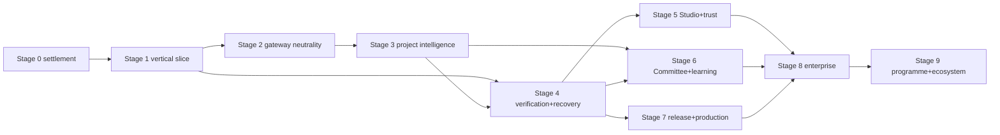

# WePLD Staged Delivery Roadmap

**Standing:** planning only. Every stage below remains unauthorized until its
gate is explicitly approved; a stage description is never permission to build.
Stages are dependency-driven, not date-driven, and map onto the existing H1–H9
gates of [22 — Milestones](../22_Milestones.md) rather than inventing a
competing numbering.

## H1–H9 mapping

| Stage | H anchor | Justification |
| --- | --- | --- |
| 0 | pre-H1 gates | Baseline Gate, ADR dispositions, ADR-0024 spine |
| 1 | H1–H2 | governed spec workflow + plan/builder separation |
| 2 | H2–H3 | gateway/protocols beside skill-runtime foundations |
| 3 | H4 | context/LSP/retrieval milestone carries project intelligence |
| 4 | H5 | loops/sandbox milestone carries verification + recovery |
| 5 | H6-era + H9-lite | early Mission Control ships as **read-only projections** (the H9 rule: visual surfaces are projections) before full H9 breadth |
| 6 | H6–H7 | Committee gate is H6 (ADR-0026); memory/learning is H7 |
| 7 | post-H8 | release/production truth builds on certification-era evidence |
| 8 | post-H9 | enterprise/team |
| 9 | post-H9 | programme/ecosystem |

## Stage dependency graph

No cycles: each stage consumes only earlier stages' exits. Stages 2/4 and 3/6
may overlap in calendar time but not in gate order.

## Stage 0 — Architecture and baseline settlement

**Entry criteria:** Draft PRs #1–#3 at their frozen heads; validators green.
**Exit criteria:** independent review dispositions ADR-0015–ADR-0026; Build
Feature Baseline Gate resolved; authority contracts frozen; ADR-0024
Evaluation Spine operational. **Dependencies:** none. **User-visible value:**
none yet — honesty is the feature. **Technical acceptance:** doc validators +
spine fixtures green. **Security acceptance:** threat models reviewed.
**Evaluation:** n/a (settlement). **Rollback:** revise documents. **Excluded:**
all implementation. **Authorization gate:** founder + independent review
disposition every Proposed ADR.

## Stage 1 — Governed vertical slice (V0)

**Entry criteria:** Stage 0 exit. **Exit criteria:** the V0 journey (below)
passes on a fixture repo and one real bounded outcome with a terminal, honest
result. **Dependencies:** S0. **User-visible value:** one governed,
evidence-backed delivery. **Technical acceptance:** EV-S1 arms terminal;
deterministic gates; recovery drill passes. **Security acceptance:** worktree
confinement, payload bounds, Effect Firewall path (the PR #1 boundary suite)
green. **Evaluation:** EV-S1–EV-S5 baseline arms. **Rollback:** none needed —
single-slice. **Excluded:** Committee runtime, SkillHouse marketplace, Program
Mode, full IDE, autonomous merge, broad routing, global learning, production
orchestration. **Authorization gate:** explicit V0 implementation approval.

## Stage 2 — Provider and worker neutrality

**Entry criteria:** S1 exit. **Exit criteria:** Universal Agent Gateway with
capability handshake; two protocol families conformant; role isolation; one
external provider family admitted under policy; identity assurance recorded
per PR #3 contract. **Dependencies:** S1. **User-visible value:** choice of
runtime without governance change. **Technical acceptance:** conformance
tests; EV-S10/EV-S13 arms. **Security acceptance:** egress policy enforced;
no consumer-subscription pathway exists; credential boundary audited.
**Evaluation:** provider-neutrality arms. **Rollback:** disable an adapter
class by policy. **Excluded:** diversity-based routing (needs EC-A7/EC-A8
later), external coding-agent workers. **Authorization gate:** per-adapter
admission decision.

## Stage 3 — Project intelligence foundation

**Entry criteria:** S2 exit. **Exit criteria:** Project DNA + Constitution
Compiler emitting enforceable rules; Truth Graph v1; Context Compiler with
exact/LSP/structural selection, redaction, hashes, exclusions; Decision Inbox
queue in Core. **Dependencies:** S2 (packs travel through the gateway).
**User-visible value:** explainable context; "Ask Why" answers; fewer
irrelevant model inputs. **Technical acceptance:** retrieval ablations;
graph-rebuild-from-ledger drill. **Security acceptance:** redaction fixtures;
projection hashes. **Evaluation:** EV-S7/EV-S8. **Rollback:** fall back to
exact-only context. **Excluded:** semantic retrieval (conditional on
ablation), Digital Twin. **Authorization gate:** stage review.

## Stage 4 — Verification and recovery foundation

**Entry criteria:** S1 exit (S3 enriches but does not block). **Exit
criteria:** Verification Lab with claim-to-evidence mapping, acceptance
coverage, proof gaps, evidence freshness; Flight Recorder projection;
Recovery Room drills for the crash matrix; Change Passport v1.
**Dependencies:** S1. **User-visible value:** trustworthy "done"; guided
recovery instead of fear. **Technical acceptance:** seeded-gap corpus caught;
recovery drills deterministic. **Security acceptance:** evidence-fabrication
threat checks. **Evaluation:** EV-S4/EV-S5/EV-S15. **Rollback:** the slice
gates (PR #1 style) remain the floor. **Excluded:** release/production
machinery. **Authorization gate:** stage review.

## Stage 5 — Studio and trust adoption

**Entry criteria:** S4 exit. **Exit criteria:** Mission Control (read/decide
surfaces over Core projections), Shadow Mode, Autonomy Ladder levels 0–3,
Policy Studio v1, material-decision filtering, approval expiry.
**Dependencies:** S4. **User-visible value:** the cockpit; observation without
interruption. **Technical acceptance:** surface-utility studies; decision
burden measured. **Security acceptance:** surfaces are projection-only;
no state bypass. **Evaluation:** EV-S16; Shadow Mode false-warning rate.
**Rollback:** CLI remains fully sufficient. **Excluded:** full IDE, ladder
levels 4–6, Mission Simulator claims. **Authorization gate:** stage review.

## Stage 6 — Committee V0 and private learning

**Entry criteria:** S3+S4 exits; doc-37 admission evidence (terminal EC-A1,
EC-A2, EC-A3, EC-A5, EC-A6; no rejection criterion fired). **Exit criteria:**
user-triggered three-member Committee V0 per PR #3; Memory Judge + governed
Engineering Memory; project SkillHouse (kernel, evaluation, canary, no
marketplace); Benchmark Arena + Trust Registry v1; DeepLearn candidates.
**Dependencies:** S3, S4. **User-visible value:** deliberation on demand;
compounding project intelligence. **Technical acceptance:** doc-36/37
contracts enforced. **Security acceptance:** minority-projection and identity
assurance boundaries; poisoning defenses. **Evaluation:** doc-37 arms; EV-S6/
EV-S9/EV-S11/EV-S12. **Rollback:** Committee and learning are disable-safe —
the delivery loop stands alone. **Excluded:** auto-triggered Committees,
diversity routing (EC-A7/EC-A8 first), global SkillHouse. **Authorization
gate:** ADR-0026 acceptance + stage review.

## Stage 7 — Release and production truth

**Entry criteria:** S4 exit; certification-era evidence maturing. **Exit
criteria:** Release Guardian; Migration and Data Safety Lab; Supply-Chain
Guardian; Production Truth Loop v1; feature-flag/canary integration; Incident
Commander. **Dependencies:** S4 (+S6 evidence enrichments). **User-visible
value:** releases that carry proof; production honesty. **Technical
acceptance:** release-evidence fixtures; migration drills; SBOM/provenance
standards adopted. **Security acceptance:** supply-chain threat checks;
telemetry redaction. **Evaluation:** EV-S17. **Rollback:** ship without the
Guardian (manual release) — never fake its evidence. **Excluded:** automatic
rollback authority. **Authorization gate:** stage review.

## Stage 8 — Team and enterprise

**Entry criteria:** S5–S7 exits. **Exit criteria:** organizations, human–AI
workforce (human TaskPackets), separation of duties, delegation with expiry,
enterprise policy, audit retention, private gateways/SkillHouse, sovereign
deployment modes, Sovereignty and Exit Pack. **Dependencies:** S5, S6, S7.
**User-visible value:** teams and regulated organizations. **Technical
acceptance:** tenant-isolation fixtures; export/import round-trip drills.
**Security acceptance:** cross-project contamination, stale-authorization,
audit-retention checks. **Evaluation:** enterprise pilot metrics.
**Rollback:** single-user mode unaffected. **Excluded:** Program Mode.
**Authorization gate:** stage review.

## Stage 9 — Programme and ecosystem scale

**Entry criteria:** S8 exit. **Exit criteria:** Program Mode (cross-repository
contracts, coordinated changes, synchronized releases); Domain Packs; opt-in
global SkillHouse; extension SDK + conformance + signing; certified
marketplace evaluation. **Dependencies:** S8. **User-visible value:**
portfolio-scale governance; ecosystem. **Technical acceptance:** cross-repo
evidence fixtures; SDK conformance. **Security acceptance:** marketplace
poisoning defenses; no shared writable workspace. **Evaluation:** programme
pilots; marketplace-readiness review. **Rollback:** each ecosystem element is
individually disable-safe. **Excluded:** anything claiming automatic legal
compliance. **Authorization gate:** stage review + commercial decision.

## V0, V1, V2

**V0 (Stage 1):** one repository + one Hermes-compatible runtime + one bounded
low-risk outcome + specification approval + qualified plan approval + isolated
Builder execution + deterministic evidence + independent Consulting review +
explicit completion decision + one honest recovery path. Exclusions as listed
in Stage 1. The Draft PR #1 slice is V0's unmerged seed; the V0 delta is the
formal plan-qualification step and the structurally independent Consulting
review.

**V1 (smallest credible):** V0 + Context Compiler v1 (exact/LSP, redaction,
hashes) + Verification Lab v1 (claim-to-evidence + proof gaps) + Decision
Inbox + Flight Recorder projection + Shadow Mode. Still one provider family,
no Committee, no learning promotion.

**V2:** V1 + Universal Agent Gateway with a second admitted provider family +
Project DNA/Constitution v1 + Truth Graph v1 + Change Passport + Committee V0
(only if the doc-37 gate passes) + project-scoped SkillHouse. Still no
marketplace, no Program Mode, no global learning.

## Future ADR candidates (named, not created)

ADR-0027 Universal Agent Gateway protocols · ADR-0028 Capability Leasing ·
ADR-0029 Project DNA/Constitution authority · ADR-0030 Truth Graph +
Change Passport contracts · ADR-0031 Verification Lab evidence contract ·
ADR-0032 Autonomy Ladder policy · ADR-0033 SkillHouse certification ·
ADR-0034 Release Guardian + Production Truth Loop · ADR-0035 enterprise
tenancy + delegation · ADR-0036 Program Mode · ADR-0037 external
agent-runtime adapters (including any Letta adapter) · ADR-0038 open
protocol SDK + marketplace governance. Each is created only when its stage
gate needs it.
